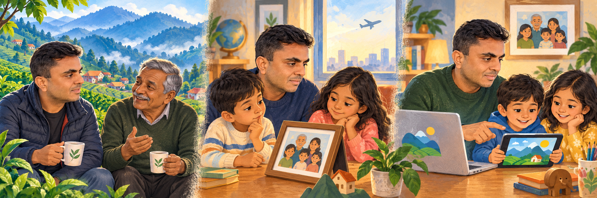
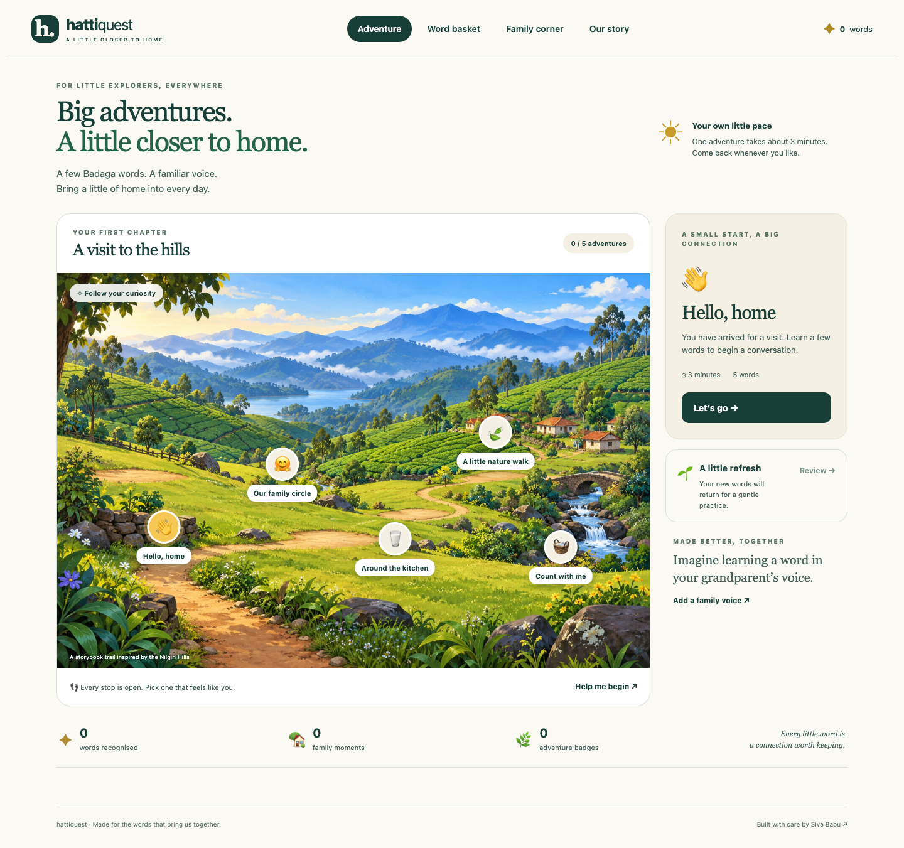
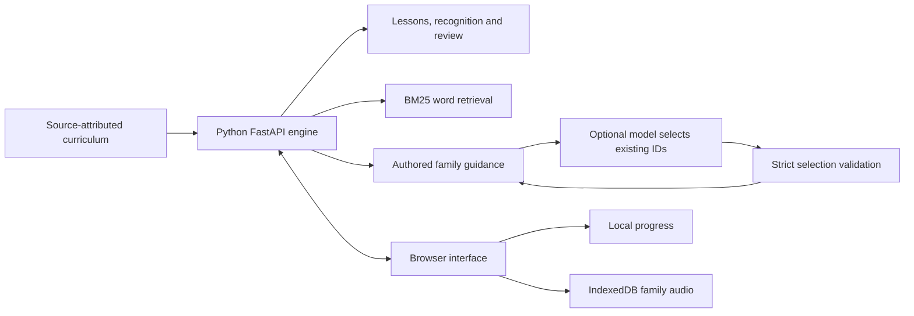

# Hatti Quest

**Little adventures. Familiar voices. A little closer to home.**

A Python web app for Badaga children growing up outside India: playful, short language adventures that continue in conversations with family.



## Why I’m building this

**I’m Siva Babu, and I’m Badaga.**

The Badaga community is rooted in the Nilgiri Hills of Tamil Nadu, India. Our language carries everyday conversations, family memories and a sense of belonging. [Community language and culture resource](https://badaga.co/).

For children growing up outside India, there may be few chances to hear and speak Badaga every day. A child can feel deeply connected to their roots and still struggle to find the words when talking with a grandparent.

I’m building Hatti Quest to bring our language into those small, ordinary moments: a playful adventure, a word heard in a familiar voice, a conversation that continues after the screen is put away. The aim is to help children feel curious, connected and comfortable trying—and to keep our culture present in everyday family life.

AI helps organise and retrieve learning material. Families and fluent speakers give it meaning and its voice. This project grew from my AI learning and earlier work on evidence-based retrieval, bounded learning guidance and review practice, with Codex helping turn those ideas into this product. It is an original implementation for this audience; it makes no claim to be the first heritage-language learning app.

The illustration uses my public GitHub profile photo, at my request. The scenes and other people are fictional, and illustrate the product’s purpose rather than a personal biography.

## Try the first chapter



| Experience | What you can do |
| --- | --- |
| A visit to the hills | Pick any of five adventures: conversations, family, everyday life, nature and counting. |
| Tiny word games | Meet five words, try three-choice recognition, get gentle corrections and earn a badge. |
| Your word basket | Search 50 source-documented words and phrases in English or Romanised Badaga. |
| A little refresh | Return to words over intervals of 1, 2, 4, 8 and 14 days. A missed word returns the next day. |
| Family voices | A grown-up records up to 20 seconds, or imports a family audio file. Hear it in lessons and the word basket. |
| Beyond the screen | Try a small activity with family after each adventure. |
| Helpful guide | Get authored tips with source-linked vocabulary, optionally selected by a configured language model. |
| A learning keepsake | Save progress in this browser; export and import a JSON backup. Download individual recordings separately. |

Every adventure is open from the start. Recognition counts; there are no punitive streaks, leaderboards or accent scores.

## Run locally

Requires **Python 3.12 or newer**. There is no frontend build or API key requirement.

```bash
git clone https://github.com/sivalinb/hatti-quest.git
cd hatti-quest
python3 -m venv .venv
source .venv/bin/activate
pip install -r requirements.txt
python run.py
```

Open **http://127.0.0.1:8765**. On Windows activate with `.venv\Scripts\activate`.

Use `python run.py --port 8000` to change the port. Family recording works on localhost or HTTPS in a browser that supports MediaRecorder. If a microphone is unavailable, use **Choose audio** in Family corner. Choose your own short audio file under 2 MB.

Docker packaging is also included:

```bash
docker build -t hatti-quest .
docker run --rm -p 127.0.0.1:8765:8765 hatti-quest
```

The repository is public; the app runs wherever you start the Python server. A public hosted instance has not been deployed. For hosting, run behind an HTTPS reverse proxy, use the health endpoint `/health`, and preserve the original host and scheme. Public microphone recording requires HTTPS. Switching domains or ports creates a different browser storage space.

## Python architecture and AI boundaries



Curriculum, quizzes, answer evaluation, review scheduling, lexical retrieval and guide orchestration are Python. Jinja serves the page; plain JavaScript handles browser interaction, microphone access and local storage. CSS and original generated illustrations supply the interface. There is no Node requirement to run the app.

The default guide works entirely from authored tips and published vocabulary. It does **not** call a language model. An optional HTTPS, OpenAI-compatible chat-completions provider may select 1–4 existing word IDs for a fixed topic. The server rejects unknown words, changed topics, duplicates and extra generated fields; provider failures fall back to the source guide. The model does not author Badaga sentences, translate free text, synthesise voices or evaluate pronunciation.

To enable a live selector, set environment variables before starting Python:

```bash
export HATTI_AI_BASE_URL="https://your-provider.example/v1"
export HATTI_AI_MODEL="your-model-id"
export HATTI_AI_API_KEY="your-server-side-key"
export HATTI_ENABLE_LIVE_AI="1"
python run.py
```

`.env.example` documents these settings; the app reads process environment variables, not `.env` files automatically. Keep credentials outside source control. The provider receives only the fixed topic and public curriculum evidence. No learner name, learning progress or recording is sent. Live selection is covered with mocked provider tests; a real provider has not been configured or tested for this release.

## Community content and privacy

The starter’s word forms follow [Bellie Jayaprakash’s learning page](https://badaga.co/learn-badaga/) and [family relationship list](https://badaga.co/2019/04/28/learn-badaga-5/). Each entry links back to its source. Teaching notes, activities and interface copy are original. **Community speaker review is pending.** Roman spellings and usage can vary, and respectful forms matter. A family recording complements a source form; it is not a global certification.

There are no accounts, analytics, advertisements or voice-upload endpoints. Progress stays in localStorage and family recordings stay in IndexedDB on the current browser and device. They do not automatically sync. Clearing browser data removes them. The progress backup does not contain audio; save individual audio downloads if you want to keep them. The server processes word answers and review state transiently, without writing a learner database. Ordinary server logs may include request URLs and IP addresses.

Use recordings made with the speaker’s agreement. External dictionaries, research corpora, songs and archive audio are linked as resources, not copied into the app. See [sources and content notes](docs/SOURCES.md) and [contributing](CONTRIBUTING.md).

## Verify the app

```bash
pip install -r requirements-dev.txt
python -m pytest -q
```

The 24 Python tests cover the learning flow, retrieval, input validation, browser origin boundaries, review timing and model selection/fallback. Optional browser tests exercise real recording with a synthetic microphone, persistence, playback, search, import/export, review and 320/375 px layouts:

```bash
# In a separate terminal, with the Python app already running:
npm install --no-save playwright@1.62.1
npx playwright install chromium
node tests/browser.spec.cjs
```

Set `CHROME_EXECUTABLE` to an installed Chrome binary instead of downloading Chromium if desired. Node is only for optional browser tests. Screenshots and the tested scope are recorded in [validation notes](docs/VALIDATION.md). GitHub Actions runs the Python and browser checks.

## Help this grow

The most useful next contribution is a fluent speaker checking spelling, meaning, everyday usage and respectful forms. Add evidence and family variants before expanding lessons. Future chapters could explore reviewed family stories, food, place memories and celebrations with community contributors.

Software and original documentation are MIT licensed. This licence does not grant rights to third-party resources, personal likenesses or family recordings. Generated illustrations and attribution are described in [ASSETS.md](static/assets/ASSETS.md).
