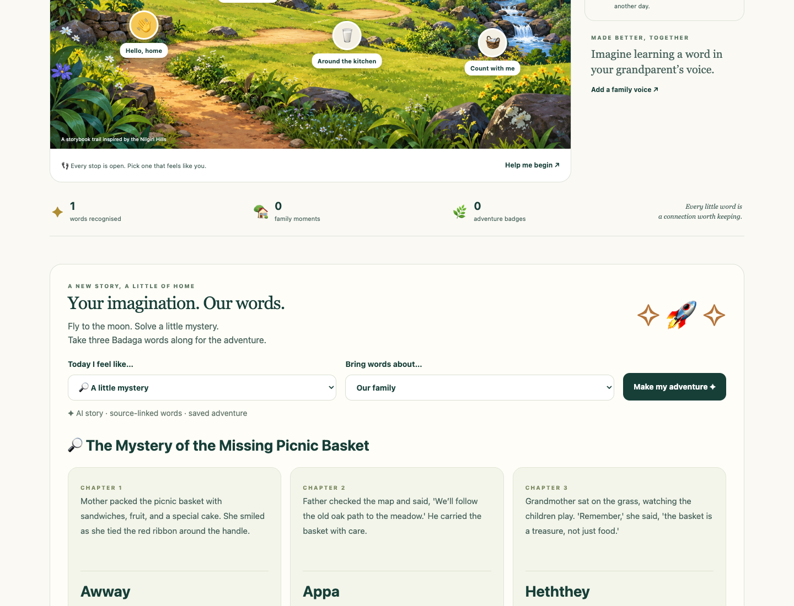
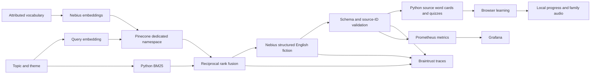
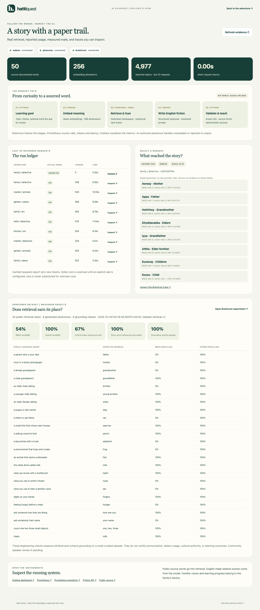

# Hatti Quest

**Little adventures. Familiar voices. A little closer to home.**

A Python AI application for Badaga children growing up outside India: short language adventures that continue in conversations with family.

[](https://github.com/sivalinb/hatti-quest/actions/workflows/ci.yml)


## Why I’m building this

**I’m Siva Babu, and I’m Badaga.**

Our community is rooted in the Nilgiri Hills of Tamil Nadu, India. Badaga is a Dravidian language carrying everyday conversations, family memories and belonging. India’s **2011 Census recorded 133,550 Badaga mother-tongue speakers**. This is a dated count in India, rather than a current worldwide estimate. [Census source](https://censusindia.gov.in/nada/index.php/catalog/42458/download/46089/C-16_25062018.pdf).

Badaga has a strong oral tradition and no single broadly standardised native orthography. Roman, Tamil and Kannada writing are used, and dedicated scripts have been proposed. The challenge includes preserving sounds, preferred forms and opportunities to speak. [Community script discussion](https://badaga.co/2019/08/09/a-script-for-badaga/), [Paul Hockings’ published correspondence](https://badaga.co/2013/06/25/badaga-the-language/).

For children growing up outside India, chances to hear and speak Badaga can be few. A child can feel connected to their roots and still struggle to find the words with a grandparent. Busy routines and time zones can make the gap harder to bridge.

I’m building Hatti Quest to bring our language into small, ordinary moments: a playful adventure, a word heard in a familiar voice, a conversation that continues after the screen is put away. AI organises evidence and creates English story scaffolds. Families and fluent speakers give the words their meaning and voice.

This connects my AI learning with a problem close to my community. Codex helped build the implementation, tests, illustrations and demo. It is an original implementation for this audience; it makes no claim to be the first heritage-language learning app. The illustration uses my authorised public profile likeness. Its scenes and other people are fictional.

## Watch and explore

The **five-minute narrated demo** covers the Nilgiris, Badaga, the diaspora problem, the working app, real AI usage and extension to other languages. Narration is synthetic English, rather than the founder’s recorded voice. [Demo and sources](docs/DEMO.md).


| Experience | What it does |
| --- | --- |
| A visit to the hills | Five open adventures: conversation, family, everyday life, nature and counting. |
| Tiny word games | Recognition, gentle feedback, badges and spaced review. |
| Story Studio | Three AI-generated English scenes with source-linked Badaga word cards and a family activity. |
| Word basket | Search 50 source-documented words and phrases. |
| Familiar voices | Record or import a short family voice; hear it in lessons and generated adventures. |
| Learning keepsakes | Local progress, export/import backups and individual audio downloads. |
| AI evidence | Actual run modes, retrieval ranks, tokens, latency, sources, traces and evals. |

Every adventure is open. No punitive streaks, leaderboards or automatic accent grades.



## Run locally

Requires **Python 3.12+**. The authored experience works without keys. There is no frontend build.

```bash
git clone https://github.com/sivalinb/hatti-quest.git
cd hatti-quest
python3 -m venv .venv
source .venv/bin/activate
pip install -r requirements.txt
python run.py
```

Open **http://127.0.0.1:8765**. The evidence dashboard is **http://127.0.0.1:8765/lab**. On Windows activate with `.venv\Scripts\activate`. Use `--port 8000` to change the port. Recording requires localhost or HTTPS and MediaRecorder. **Choose audio** supports family audio under 2 MB; recordings are limited to 20 seconds.

## Enable real AI

Set process variables from [.env.example](.env.example), or use private key files. Python does not automatically load `.env`. Never commit credentials.

```bash
export HATTI_ENABLE_LIVE_AI=1
export NEBIUS_API_KEY="your-private-key"
export PINECONE_API_KEY="your-private-key"
export PINECONE_INDEX_HOST="your-index-host"
export BRAINTRUST_API_KEY="your-private-key"
python -m hatti.cli ingest
python -m hatti.cli eval
python run.py --live
```

Private file configuration is also supported:

```bash
python -m hatti.cli ingest --live \
  --nebius-key-file /private/path/nebius-key \
  --pinecone-config-file /private/path/pinecone-config
python run.py --live \
  --nebius-key-file /private/path/nebius-key \
  --pinecone-config-file /private/path/pinecone-config \
  --braintrust-key-file /private/path/braintrust-key
```

The Pinecone file accepts `PINECONE_API_KEY` and `PINECONE_INDEX_HOST` assignments. Use a **256-dimensional dense index** with the default configuration. Ingestion upserts 50 stable `hq:` IDs into **`hatti-quest-v1`**, without deleting or modifying other namespaces. A corpus fingerprint rejects stale or unrelated vectors. Re-ingest after content changes; keep embedding model and dimensions consistent.

Nebius runs `Qwen/Qwen3-Embedding-8B` and `Qwen/Qwen3-30B-A3B-Instruct-2507`. Both are configurable; availability depends on the account. Braintrust is the chosen tracing and experiment service.

## The AI system



The model receives fixed themes and English meanings attached to known word IDs. It writes **English make-believe scenes**. Python supplies the Badaga forms and recognition questions from source records. Unknown references, duplicates, extra fields, malformed responses and markup are rejected. Structural checks do not certify linguistic or cultural quality.

Hybrid retrieval combines lexical and vector ranks with RRF, k=60. Optional review IDs take explicit priority. Timeouts and a circuit breaker handle provider failures. Authored adventures remain available when AI is disabled, unavailable or rejected. Successful adventures are cached for 24 hours. A process-wide ceiling allows six story requests per minute without collecting child IP addresses for rate limiting.

The ledger distinguishes `live`, `cached-live`, `authored`, `cached-authored` and `fallback`. Cached requests report **zero new tokens**. Invalid model output preserves reported billed tokens. **Dollar cost is unknown**, because no price schedule is configured. Braintrust traces contain public learning inputs and stage evidence. Family audio, nicknames and learner profiles are excluded.

## Evals and observability

The live run uses **24 curated retrieval cases, eight generated adventures and six grounding checks**. [Full report](evals/reports/latest.json), [methodology](docs/EVALS.md).

| Measured result | BM25 | Hybrid |
| --- | ---: | ---: |
| Recall@5 | 54.17% | 100% |
| Mean reciprocal rank, within top five | 41.11% | 66.60% |

All eight adventures used valid word references; all six grounding checks passed. This is a small curated engineering dataset. It does not establish pronunciation accuracy, dialect coverage, learning effectiveness or generalisation. **Community speaker review is pending.**

`/lab` links real Braintrust traces and the experiment. `/metrics` exports calls, latency, tokens, actual modes, schema rejections and eval scores with bounded labels. Grafana includes 11 provisioned panels; Prometheus includes alert rules. [Operations guide](docs/OPERATIONS.md).

```bash
# Set GRAFANA_ADMIN_PASSWORD and optional API keys in a private .env first.
docker compose up --build -d
docker compose exec app python -m hatti.cli ingest
docker compose exec app python -m hatti.cli eval
```

The app uses **8765**, Prometheus **9097**, and Grafana **3017**, all bound to localhost. Sign into Grafana with `admin` and your configured password. Set `HATTI_OPS_TOKEN` for remote operations access; the lab has a token form. Without a token, operations APIs allow loopback clients only. Public hosting requires HTTPS and a reviewed deployment configuration. **A public hosted app is not currently deployed.**



## Community content and privacy

Source forms follow [Bellie Jayaprakash’s vocabulary](https://badaga.co/learn-badaga/) and [family relationship list](https://badaga.co/2019/04/28/learn-badaga-5/). Each word links to its source. Notes, activities and interface copy are original. Roman spellings, respectful forms and household usage need speaker review.

No accounts, advertisements or voice-upload endpoints. Progress stays in localStorage; recordings stay in IndexedDB on this browser and device. They do not sync automatically. Clearing browser data removes them. Progress export excludes audio; download recordings separately.

The server handles answers and review state transiently. AI requests contain topic, theme and optional word IDs due for review, without names, recordings or full learner history. The local SQLite AI ledger contains public learning evidence, is excluded from Git, and retains 250 recent runs. Ordinary server logs can include URLs and IP addresses. External source sites have their own policies.

Use recordings with the speaker’s agreement. Dictionaries, songs, archive audio and corpora are linked as resources rather than automatically redistributed. [Sources](docs/SOURCES.md), [contributing](CONTRIBUTING.md).

## Verify and extend

```bash
pip install -r requirements-dev.txt
python -m pytest -q
# With the app running:
npm install --no-save playwright@1.62.1
npx playwright install chromium
node tests/browser.spec.cjs
node tests/ai-browser.spec.cjs
```

**36 Python tests** and both browser workflows pass locally. Checks cover grounding, cache accounting, failures, review timing, recording persistence, backups, privacy boundaries and 320/375 px layouts. GitHub Actions runs Python 3.12/3.13 and real browser checks. [Validation](docs/VALIDATION.md).

The most valuable next contribution is fluent speaker review and family feedback. The approach can support another language with its own attributed vocabulary, permissions, writing choices, speaker review and eval cases. No other language is claimed to be supported yet. [Extension design](docs/EXTENDING.md).

Software and original documentation are MIT licensed. This does not grant rights to third-party resources, personal likenesses or family recordings. [Illustration attribution](static/assets/ASSETS.md).
